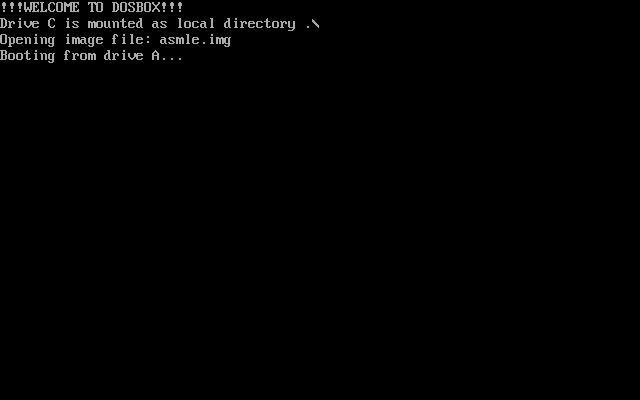

# ASMLE - Wordle in 512 bytes



Written in 3 days! (22 bytes left after cleaning up for people)

## Running

DOSBOX (COM version)

`dosbox asmle.com`

DOSBOX (Boot sector version)

`dosbox -c "mount C: ." -c "C:" -c "boot asmle.img"`

QEMU (boot sector version)

`"qemu-system-x86_64.exe" -drive format=raw,file=asmle.img`

## How does compression work
### Concept

The easiest way to compress something is to make it use less bits. We could make each letter a 4 bit index into a charset, cutting the size in half, a word is 2.5 bytes now. But wait, let's not forget we are doing real computing here. Here's our today's guest: padding! Padding turns our sweet 2.5 bytes into 3 bytes, what a rude guy. But don't worry, we gotta make use of extra 0.5 bytes (4 bits) later.

We need a lookup table for characters. Let's introduce "charset" - **a set of 16 characters**. 
We'll have 2 such charsets to make the game more varied and gain more points for added complexity. This is where extra 4 bits go, they become charset index, it takes values from 0 to 1. Padding will help us save space on decompression routine by making it possible to extract all of the values in a sequence. The formula for getting the decompressed character becomes `charset*16 + char`.


Here's the resulting word format

```
cs   ch0  ch1  ch2  ch3  ch4
|    |    |    |    |    |
v    v    v    v    v    v
0000 0000 0000 0000 0000 0000
```

### Generation

`makedict.py` generates a dictionary by first generating a charset: by picking up 16 random characters from English alphabet and then it takes 32 words that match that set. We do it twice to get 2 dictionaries.

Then the script writes charsets and the words into a binary file which is then included into the game executable itself.

Vocabulary format
```
charset1 (16 bytes)
charset2 (16 bytes)
64 words (3 bytes each)
```

### Decompression
See `main.asm:148`